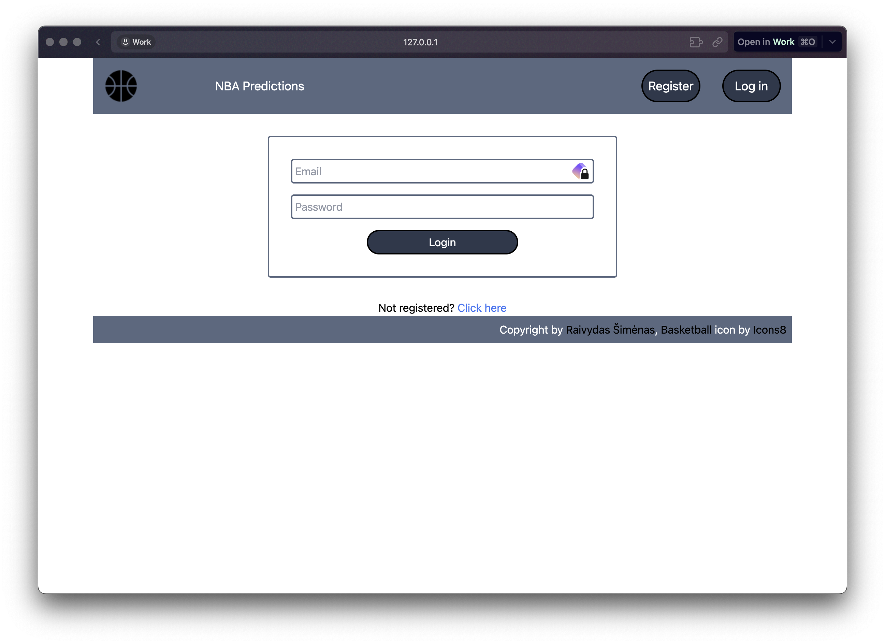
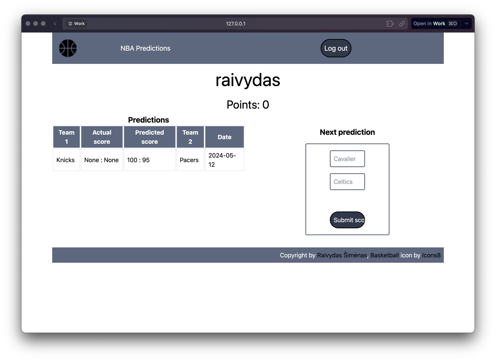

# NBA Predictions

## Video Demo: https://youtu.be/6loG6iT9n-E

## Description

Implementation of NBA game score predictions. Uses Python Flask framework and SQLite database. For Python package management, I venv and pip. The program contains a login screen, where you can also register. The dashboard contains your last 10 predictions on the left and a form to make a prediction on the right. At the top, the username and the user's score is displayed. The data about the games is fetched using the API-NBA online datasource. The database keeps its last access date and, upon user logging in, fetches the new data from the API up until tomorrow's date. It also calculates the user's score based on a certain formula.

Login screenshot:



Predictions screenshot:


## Installation

To install the application, clone the repository and run the following commands in the terminal:

```bash
python -m venv venv
source venv/bin/activate
pip install -r requirements.txt
```

In the root folder, create a .env file and add the following lines:

```bash
SQLALCHEMY_DATABASE_URI= # database file name, e.g. database.db
SECRET_KEY= # secret key
API_NBA_KEY= # API-NBA key
```

To run the application for the first time, run the following command:

```bash
python run.py
```

This creates the database and populates it with the data from the API. After the first run, comment out lines below 24 in ./app/__init__.py file to prevent the database from being populated every time the application is run.

## Description

The root folder contains run.py file which only contains the application run command. requirements.txt file lists the Python packages which have to be installed. The environment variables are contained in the .env file, which due to security reasons is not included on GitHub. The environment variables are SQLALCHEMY_DATABASE_URI (the URI string to the database), SECRET_KEY, and API_NBA_KEY (the API-NBA key). You can obtain the API-NBA key by registering on the Rapid API website.

app folder contains __init__.py file that initializes the application. config.py grabs the environment variables from .env. The program uses SQLAlchemy as the tool to interact with the database at WTForms to manage the forms. forms.py contains the registration, login, and prediction forms. models.py file describes the database tables: User, Game, Prediction, and Access. Prediction table keeps track of the predictions of all the users. It keeps foreign keys to User and Game tables. User table contains the information about the users of the program. Game table keeps track of the game scores. views.py file contains the code that responds to various routes, such as /, /prediction, /login, /register, and /logout.

templates folder contains the html documents which use the Jinja templating language. layout.html is the base layout page that contains the navigation bar. apology.html displays error messages. login.html and register.html are templates for logging in and registering respectively. dashboard.html displays the dashboard. static folder contains the basketball icon used in the project by Icons8.
